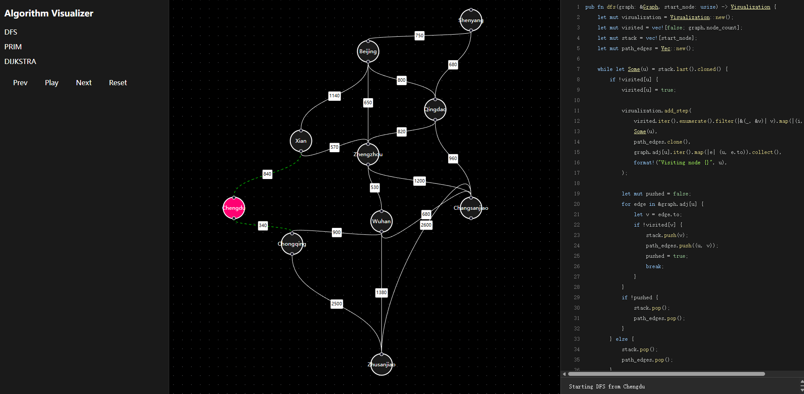

# Graph Algorithm Visualizer

This project is an interactive tool for visualizing common graph algorithms, including Depth-First Search (DFS), Prim's algorithm for Minimum Spanning Trees, and Dijkstra's algorithm for shortest paths.

The backend is built with Rust, which runs the algorithms and generates step-by-step visualization data. The frontend is a React application that reads this data and provides a dynamic, animated visualization of the algorithms' execution.

# Screenshot




# Features

- **Algorithm Selection**: Easily switch between DFS, Prim, and Dijkstra algorithms.
- **Interactive Playback**: Control the visualization with play, pause, next, previous, and reset buttons.
- **Graph Visualization**: A clear representation of the graph, with nodes and edges that change color to reflect the current state of the algorithm.
- **Code Display**: See the underlying Rust code for the selected algorithm.
- **Step-by-Step Explanation**: Understand what's happening at each step with a clear textual explanation.

# How to Run

To get the visualizer running, you need to first generate the algorithm data with the Rust backend, and then start the React frontend.

### 1. Generate Algorithm Data (Backend)

Navigate to the Rust project directory and run the application:

```shell
cd lab4-rust-code4visualizer
cargo run
```

This command will execute the graph algorithms and create three JSON files (`dfs_steps.json`, `prim_steps.json`, `dijkstra_steps.json`) inside the `lab4-web-visualizer/src` directory.

### 2. Start the Visualizer (Frontend)

Navigate to the web visualizer directory, install the dependencies, and start the development server:

```shell
cd lab4-web-visualizer
# npm install # Run as administrator
npm run dev
```

Once the server is running, you can open your browser and go to [http://localhost:5173](http://localhost:5173) to use the application.

# How to Use

**Important**: Before using the visualizer, make sure you have generated the latest algorithm data by following the steps in the "How to Run" section (specifically, running `cargo run` in the backend directory).

1.  **Select an Algorithm**: Use the list on the left sidebar to choose which algorithm you want to visualize (DFS, PRIM, or DIJKSTRA).
2.  **Control Playback**: Use the control buttons (`Prev`, `Play`/`Pause`, `Next`, `Reset`) to navigate through the algorithm's steps at your own pace.
3.  **Observe the Visualization**: The central panel displays the graph. Nodes and edges will be highlighted to show:
    -   **Current Node**: The node currently being processed (typically colored pink).
    -   **Visited Nodes**: Nodes that have already been visited (colored green).
    -   **Edges in Path**: Edges that are part of the final path or tree (colored pink).
    -   **Candidate Edges**: Edges being considered by the algorithm (animated/glowing green).
4.  **Review the Code and Explanation**: The bottom panel shows the Rust code for the selected algorithm and a text description of the current visualization step.


