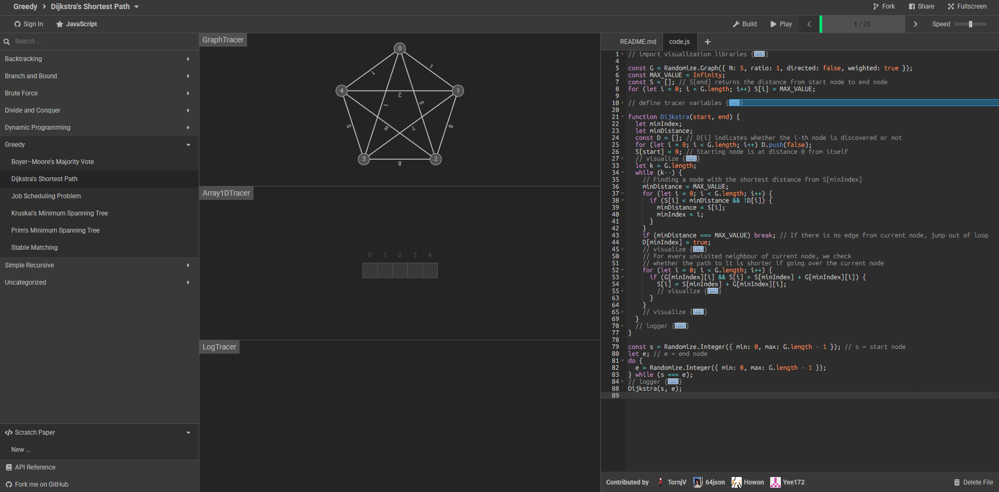

# 可视化技术

做可视化是非常让人头疼的一件事情 之前的一些想法都是把前端后端高强度耦合 which means `rust` 中调用前端函数 每执行一步`rust`算法就执行对应的可视化前端 这样大大提高了前端实现难度以及`rust`学习成本

更关键的是 这样对AI很不友好 AI很难同时处理好多种语言 `multi-end` 的代码任务 . 离开AI和CPP 我的`rust`难以支撑 .

-   现在决定仿照 [algorithm-visualizer.org](https://algorithm-visualizer.org/) 的模式 如下图所示
    -   **算法技术栈** : 使用纯`rust`实现图论算法 仅用前端做可视化展示
    -   **前端技术栈** : `Vanilla JavaScript` + `HTML5 Canvas`



这样可以将任务彻底分离 便于AI , Actually

# 架构
```text
lab4/
├── lab4-rust-code4visualizer/           # 💻 Rust算法库 仅实现算法
│   ├── Cargo.toml
│   └── src/
│       ├── lib.rs
│       ├── graph.rs           # Rust的图数据结构实现
│       ├── dfs.rs
│       ├── prim.rs
│       └── dijkstra.rs
|
├── lab4-web-visualizer/       # 🎨 Web可视化 (Vanilla JS + HTML5 Canvas)
│   ├── index.html             # 主目录页 (导航到各个算法页面)
│   ├── dfs.html               # DFS可视化页面
│   ├── prim.html              # Prim可视化页面
│   ├── dijkstra.html          # Dijkstra可视化页面
│
│   ├── css/
│   │   └── style.css          # 通用样式
│
│   ├── js/
│   │   ├── common/                     # 核心通用模块
│   │   │   ├── CanvasRenderer.js       # 负责所有图的绘制/更新逻辑
│   │   │   ├── GraphModel.js           # 节点、边等基本图数据结构(JS实现)
│   │   │   └── SampleData.js           # 预设的已知测试图数据
│   │
│   │   └── algorithms/                 # 各算法的独立逻辑实现
│   │       ├── DFSVisualizer.js        # 包含DFS算法逻辑和可视化步骤控制
│   │       ├── PrimVisualizer.js       # 包含Prim算法逻辑和可视化步骤控制
│   │       └── DijkstraVisualizer.js   # 包含Dijkstra算法逻辑和可视化步骤控制
│
└── README.md
```

# 便捷开发

记录一些常用的指令/操作...

```shell
cd lab4-rust-code4visualizer
```

